# Academic integrity and honor code

This lab is designed to help you build your own fluency with R, RStudio, Git, and GitHub. **Generative AI tools are not permitted for this assignment.** This includes ChatGPT, Claude, Gemini, Copilot, Grok, and similar tools that can generate or revise code, written answers, interpretations, or assignment content.

By completing and submitting this lab, I certify that:

- I completed the submitted work myself.
- I did not use generative AI to generate, debug, revise, or interpret code or written answers for this assignment.
- I may use course materials, lecture notes, R documentation/help files, and other resources explicitly approved by the instructors.
- I understand that I am responsible for being able to explain all code and written work that I submit.

**Name:** ______________________________  
**Signature:** ___________________________  
**Date:** _______________________________

> **Important:** Signing this statement is part of the assignment. The same statement appears in your starter file; complete it there as well.

# Lab overview

```{marginfigure}
R is the name of the programming language itself; RStudio is an interface that makes it easier to write, run, and organize R code.
```

The main goal of this lab is to introduce you to **R** and **RStudio**, which we will use throughout the course to code, visualize, and analyze environmental data.

```{marginfigure}
Git is a version-control system (think "Track Changes" on steroids). GitHub stores Git-based projects online and makes it possible to collaborate, track changes, and recover earlier versions of your work.
```

A second goal is to introduce you to **Git** and **GitHub**, the version-control workflow we will use throughout the course.

A third goal is to reinforce the main lesson from lecture: **data visualization is important.** Summary statistics can hide important patterns in data.

Experiment beyond the minimum requirements when you have time. Trying things, breaking code, and figuring out why it broke are important parts of learning to program.

## Learning goals

By the end of this lab, you should be able to:

A. Navigate the basic RStudio interface.
B. Edit and Knit an R Markdown (`.Rmd`) document.
C. Load R packages and inspect a dataset.
D. Run simple `dplyr` and `ggplot2` code.
E. Explain why visualization should accompany summary statistics.
F. Commit and push meaningful changes with Git and GitHub.

## Deliverable

Complete **`lab-01-starter.Rmd`**. Your finished starter file should contain your code, plots, and written responses and should Knit successfully from top to bottom.

**The instructions file tells you what to do; the starter file is where your assignment work belongs, except for completing the honor-code signature above.**

## Reproducibility rule

Throughout EAES 380, your analysis should work **from top to bottom**. Code that works only because you previously ran something in the Console is not reproducible.

**Knit frequently.** Knitting is one of the best ways to discover whether your document actually contains everything needed to reproduce your work.

## Before asking for help

First check:

- Did you run the relevant chunks from top to bottom?
- Did you spell every object and variable name exactly as shown? R is case-sensitive.
- Are all parentheses, quotation marks, and backticks closed?
- Did you load the packages needed by your code?
- Does the error message point to a particular chunk or line?
- Have you tried Knitting the document to identify where the problem first occurs?

If you still cannot resolve the problem, ask your instructor or TA and show them the code and error message.

# Connecting GitHub and RStudio Cloud

**Note:** We will probably complete this setup together in class. If you have already connected your accounts, you can skip this section.

You should have received an email invitation to join the GitHub organization for this course. **Accept the invitation before continuing.**

To connect your RStudio and GitHub accounts:

- Click on your name in the top-right corner to open the menu.
- Click **Authentication**.

```{r github-auth-1, echo = FALSE}
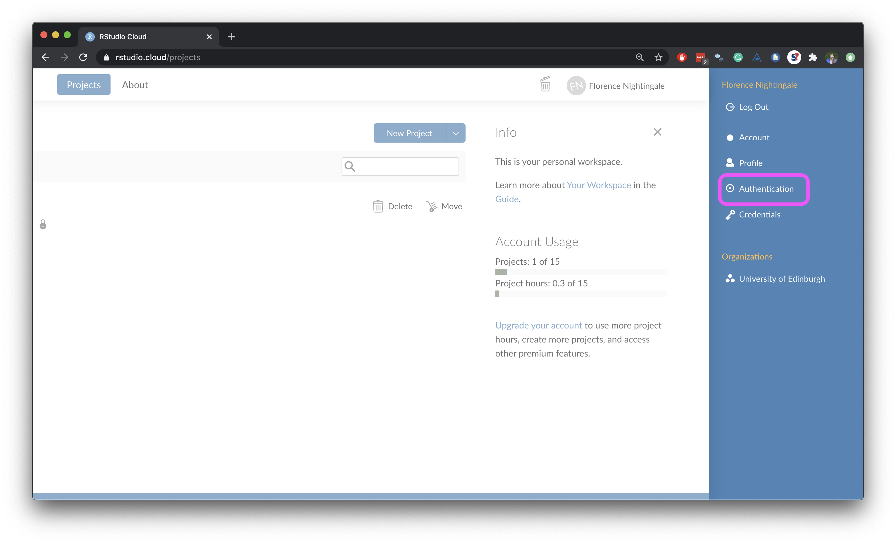
```

- In the Authentication window, check the box for *Enabled*.

```{r github-auth-2, echo = FALSE}
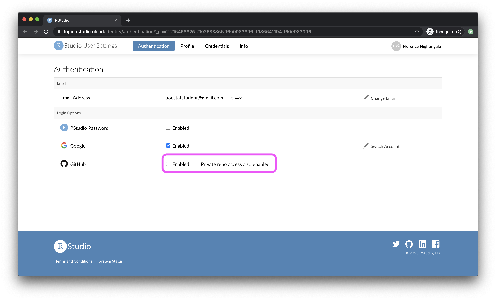
```

- In the next window, click the green **Authorize rstudio** button.

```{r github-auth-3, echo = FALSE}
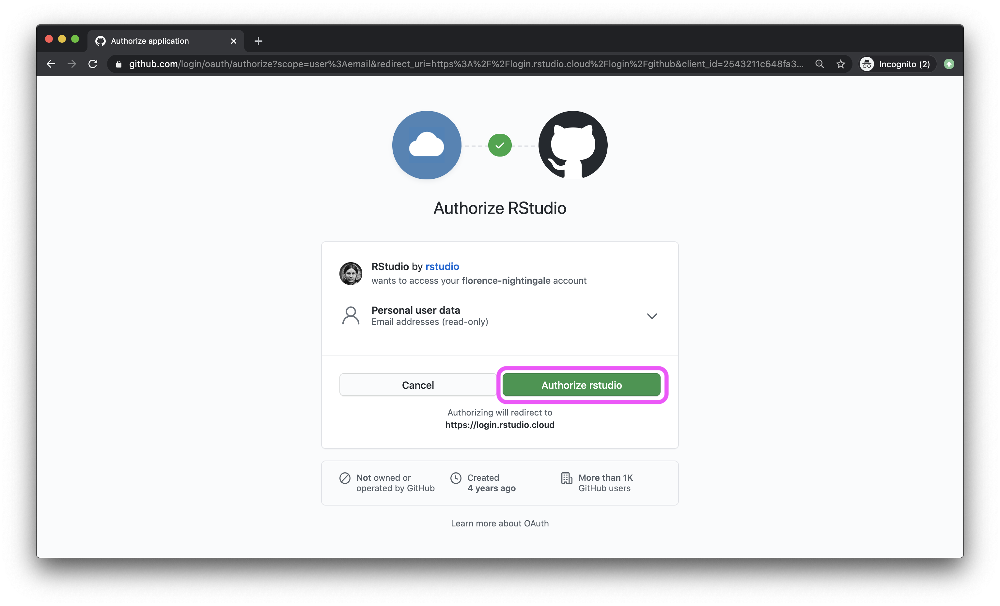
```

- Back in the Authentication window, check *Private repo access also enabled* and authorize RStudio again.
- Confirm that the course organization appears under *Organization access*. If it does not, return to GitHub and confirm that you accepted the course invitation.

```{r github-auth-4, echo = FALSE}
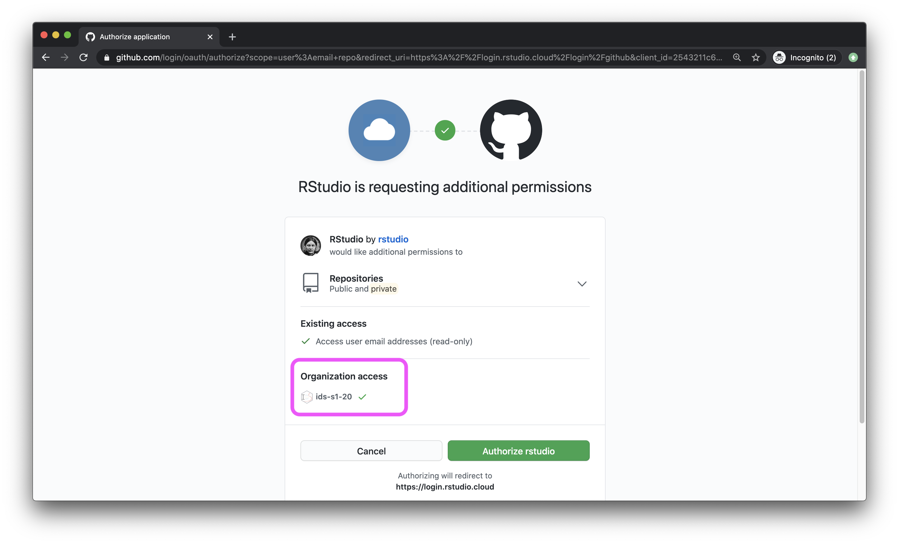
```

- When finished, both boxes should be checked.

```{r github-auth-5, echo = FALSE}
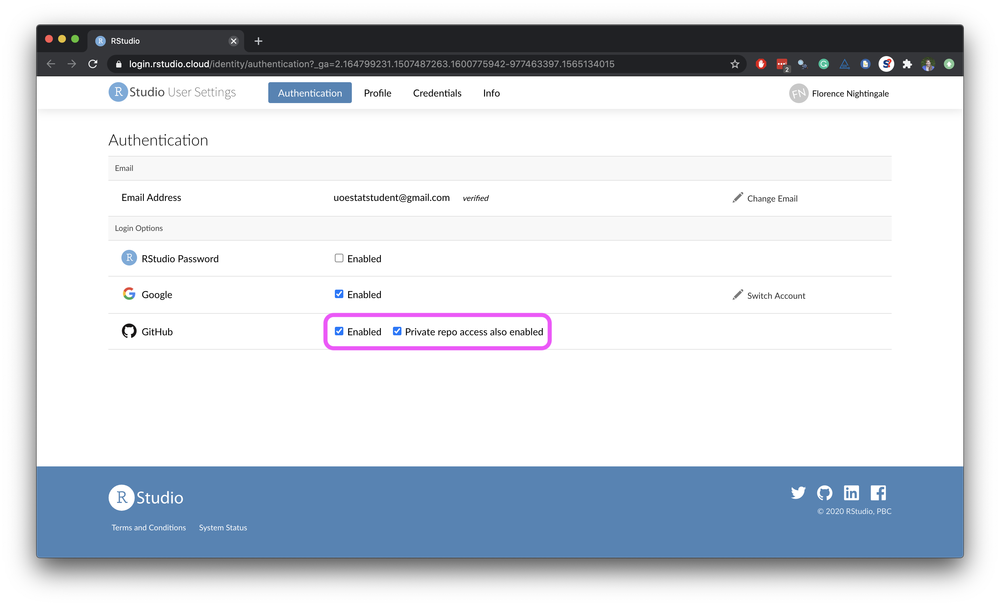
```

- To confirm the connection, open [GitHub Settings > Applications](https://github.com/settings/applications). RStudio should appear under *Authorized OAuth Apps*. If it does not, ask for help before continuing.

```{r github-auth-6, echo = FALSE}
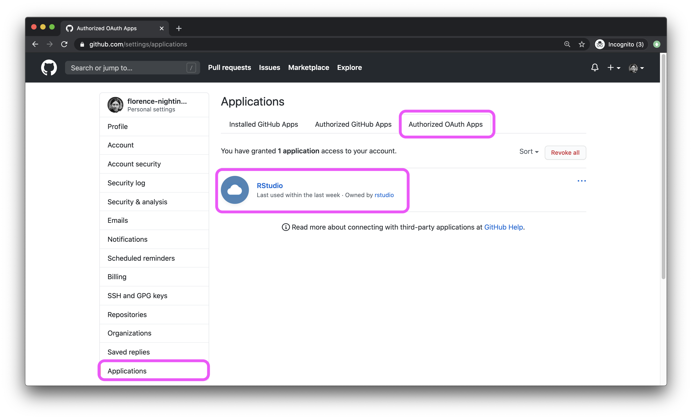
```

# Getting started

Each assignment will begin with a similar workflow.

**If you are reading a Knitted version of these instructions, you may already have completed these steps. Treat them as review.**

## Create your copy of the course repository

- Open the GitHub repository you want to copy (for example, `unit-1`).
- Add `/generate` to the end of the repository URL and press Return/Enter.
- Under **Owner**, choose `EAES-380`. **Do not choose your personal account.**
- Under **Repository name**, enter `unit-X-yourlastname`.
    - For example: `unit-1-mcnicol`.
- You can leave **Description** blank.
- Confirm that the repository is **Private**.
- Click **Create repository**.

## Create your RStudio Cloud project

- Copy the URL of your generated repository using the green **Code** button on GitHub.
- Clone it into a **New Project from a GitHub Repo** in RStudio Cloud.
- Use the **Files** pane to navigate to the appropriate exercise, lab, or homework folder.
- Open `lab-01-instructions.Rmd` and Knit it.
- Open `lab-01-starter.Rmd`. **This is the file you will complete.**

# Warm-up: R Markdown + Git

## YAML

```{marginfigure}
The section at the top of an R Markdown file between the two sets of three dashes is called YAML. It contains metadata and output settings for the document.
```

Open `lab-01-starter.Rmd`.

A. Replace `Insert your name here` with your name.
B. Replace `Insert date here` with today's date.
C. Complete and sign the honor-code statement.
D. Knit the document.

```{r yaml-raw-to-rendered, fig.fullwidth=TRUE, echo = FALSE}
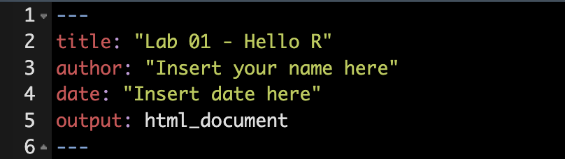
```

## Commit your changes

Go to the **Git** pane in RStudio. If you changed your `.Rmd` file, it should appear in the list.

Select the changed file and click **Diff**. The Diff view shows how the current version differs from the most recent committed version.

If the changes look correct, enter the commit message:

`Update author and honor code`

Then click **Commit**.

```{r update-author-name-commit, fig.fullwidth=TRUE, echo = FALSE}
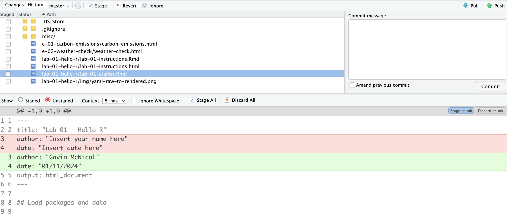
```

> **When should you commit?** You do not need to commit after every keystroke. Commit meaningful stages of your work that you may want to inspect, compare, or restore later. Early in the semester, we will suggest useful checkpoints and commit messages.

## Push your changes

A **commit** records a version of your work locally. A **push** sends those commits to your private repository on GitHub so that your instructors can see and grade them.

Click **Push** in the Git pane. Follow the authentication prompts if needed.

# Packages and data

## Load packages

In this lab we use two packages:

- **datasauRus**: contains the unusual x-y datasets used in this lab.
- **tidyverse**: a collection of packages for data manipulation and visualization.

The packages are already **installed**, but you must still **load** them into each new R session.

Navigate to `lab-01-starter.Rmd` and run the `load-packages` chunk using the green **Run Current Chunk** button.

```{r load-packages-demo, message=FALSE}
library(tidyverse)
library(datasauRus)

datasaurus_dozen <- datasaurus_dozen %>%
  rename(shape = dataset)
```

> The final two lines rename the package's `dataset` column to `shape`. You do not need to understand that code yet; we will learn the relevant tools soon.

## Inspect the data

This lab demonstrates why data visualization matters and why summary statistics alone can be misleading.

The dataset is called `datasaurus_dozen`. It contains x and y coordinates for 13 different shapes. The datasets have nearly identical summary statistics, but their visual patterns are dramatically different.

In your starter file, locate the `inspect-datasaurus` chunk and run:

```r
?datasaurus_dozen
```

A question mark before an R object or function opens its help documentation.

# Exercises

For each exercise:

A. Read the prompt here.
B. Complete the corresponding section in `lab-01-starter.Rmd`.
C. Run your code and inspect the output.
D. Write any requested interpretation in complete sentences.
E. Knit before moving on when a checkpoint is indicated.

## Exercise 1 — Learn what is in the dataset

**Goal:** Practice using R documentation to identify the size and variables of a dataset.

Based on the `datasaurus_dozen` **help file**, answer both questions in your starter file:

- How many rows and columns does the original `datasaurus_dozen` dataset contain?
- What variables are included in the original data frame?

Then run the `count-shapes` chunk in your starter file. It creates a frequency table showing the number of observations in each shape.

```{r count-shapes-demo}
datasaurus_dozen %>%
  count(shape) %>%
  print(13)
```

```{marginfigure}
Matejka, Justin, and George Fitzmaurice. "Same Stats, Different Graphs: Generating Datasets with Varied Appearance and Identical Statistics through Simulated Annealing." Proceedings of the 2017 CHI Conference on Human Factors in Computing Systems. ACM, 2017.
```

The original Datasaurus (`dino`) was created by Alberto Cairo. The other datasets (`star`, `away`, `circle`, etc.) were generated by Matejka and Fitzmaurice using simulated annealing. Their key demonstration is that datasets can share essentially the same summary statistics while having very different visual structures.

### Exercise 1 checkpoint

🧶 ✅ ⬆️ **Knit, commit, and push.** Suggested commit message: `Complete Exercise 1`.

## Exercise 2 — Visualize and summarize the dinosaur

**Goal:** Follow a complete analysis workflow: subset data → inspect data → visualize data → calculate a summary statistic.

For this exercise, the code is already provided in your starter file. **Do not replace it. Run each chunk and make sure you understand what it does.**

### Step 1: Filter the dataset

We first keep only observations belonging to the `dino` shape:

```{r filter-for-dino-demo}
dino_data <- datasaurus_dozen %>%
  filter(shape == "dino")
```

The pipe operator `%>%` passes the object on its left to the function on its right. Here, we start with `datasaurus_dozen` and `filter()` it to rows where `shape == "dino"`.

The assignment operator `<-` stores the resulting filtered data frame under the name `dino_data`.

### Step 2: Inspect the filtered data

```{r look-at-dino-head-demo}
head(dino_data)
```

`head()` displays the first few rows. Confirm that the filtered object contains the variables `shape`, `x`, and `y`.

### Step 3: Visualize the data

```{r plot-dino-demo, fig.fullwidth=TRUE}
ggplot(data = dino_data, mapping = aes(x = x, y = y)) +
  geom_point()
```

The `ggplot()` function begins the plot. `data = dino_data` identifies the data frame, while `aes(x = x, y = y)` maps variables to the x- and y-axes. `geom_point()` adds one point for each observation.

You will learn much more about the layered grammar of `ggplot2` next week. For now, focus on recognizing the basic structure.

### Step 4: Calculate a correlation coefficient

A correlation coefficient, usually written as $r$, measures the strength and direction of a **linear** relationship between two variables.

```{r dino-cor-demo}
dino_data %>%
  summarize(r = cor(x, y))
```

The dinosaur is an intentionally useful warning: a single number such as $r$ cannot tell you the shape of a relationship. **Visualize the data before deciding what a summary statistic means.**

No additional code or written answer is required for Exercise 2. Your job is to run the provided chunks and understand the workflow.

### Exercise 2 checkpoint

🧶 ✅ ⬆️ **Knit, commit, and push.** Suggested commit message: `Complete Exercise 2`.

## Exercise 3 — Repeat the workflow for the star

**Goal:** Adapt an existing analysis rather than starting from scratch.

In your starter file:

- Create a new object containing only the `star` observations.
- Plot `y` versus `x` for the `star` shape.
- Calculate the correlation coefficient between `x` and `y` for `star`.
- In **1–2 complete sentences**, compare the `star` correlation coefficient with the `dino` correlation coefficient. Does the numerical similarity match the visual similarity of the two datasets?

Reuse the Exercise 2 code as a model. Change only what needs to change.

### Exercise 3 checkpoint

🧶 ✅ ⬆️ **Knit, commit, and push.** Suggested commit message: `Complete Exercise 3`.

## Exercise 4 — Repeat the workflow for the circle

**Goal:** Reinforce the same workflow while taking more responsibility for organizing your own code.

In your starter file:

- Create a new object containing only the `circle` observations.
- Plot `y` versus `x` for the `circle` shape.
- Calculate the correlation coefficient between `x` and `y` for `circle`.
- In **1–2 complete sentences**, compare the `circle` correlation coefficient with `dino`. What does the comparison tell you about relying on correlation alone?

The code chunks in your starter file are already named descriptively. Use those names to keep your analysis organized.

### Exercise 4 checkpoint

🧶 ✅ ⬆️ **Knit, commit, and push.** Suggested commit message: `Complete Exercise 4`.

## Exercise 5 — See all of the shapes at once

**Goal:** Connect the visual evidence from all 13 datasets to their summary correlation coefficients.

First, run the provided faceted plot in your starter file:

```{r all-viz-demo, fig.fullwidth=TRUE}
ggplot(datasaurus_dozen, aes(x = x, y = y, color = shape)) +
  geom_point() +
  facet_wrap(~ shape, ncol = 3) +
  theme(legend.position = "none")
```

```{marginfigure}
`facet_wrap()` divides one plot into panels according to a categorical variable. Here, each value of `shape` gets its own panel.
```

Next, run the grouped correlation calculation:

```{r all-r-demo}
datasaurus_dozen %>%
  group_by(shape) %>%
  summarize(r = cor(x, y)) %>%
  print(13)
```

Then answer in **2–3 complete sentences**:

- What surprises you when you compare the plots with the correlation coefficients?
- Why is it important to visualize data rather than relying only on descriptive statistics?

# Finishing touches

## Resize your figures

```{r fig-resize-global, fig.margin = TRUE, echo = FALSE, fig.width=3}
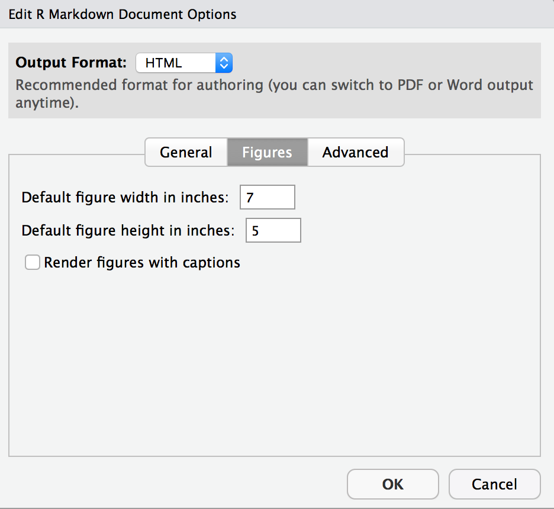
```

Use the gear icon above the R Markdown document and select **Output Options...**. In the **Figures** tab, experiment with figure height and width, then Knit again to inspect the result.

These settings are stored in the YAML. You can also change the size of individual figures using chunk options such as `fig.width` and `fig.height`.

```{r fig-resize-local, fig.margin = TRUE, echo = FALSE, fig.width=3}
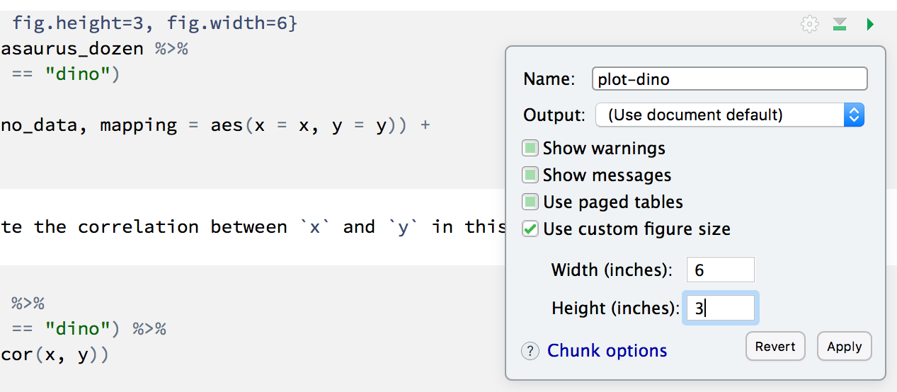
```

## Change the appearance of your report

```{r theme-highlight, fig.margin = TRUE, echo = FALSE, fig.width=3}
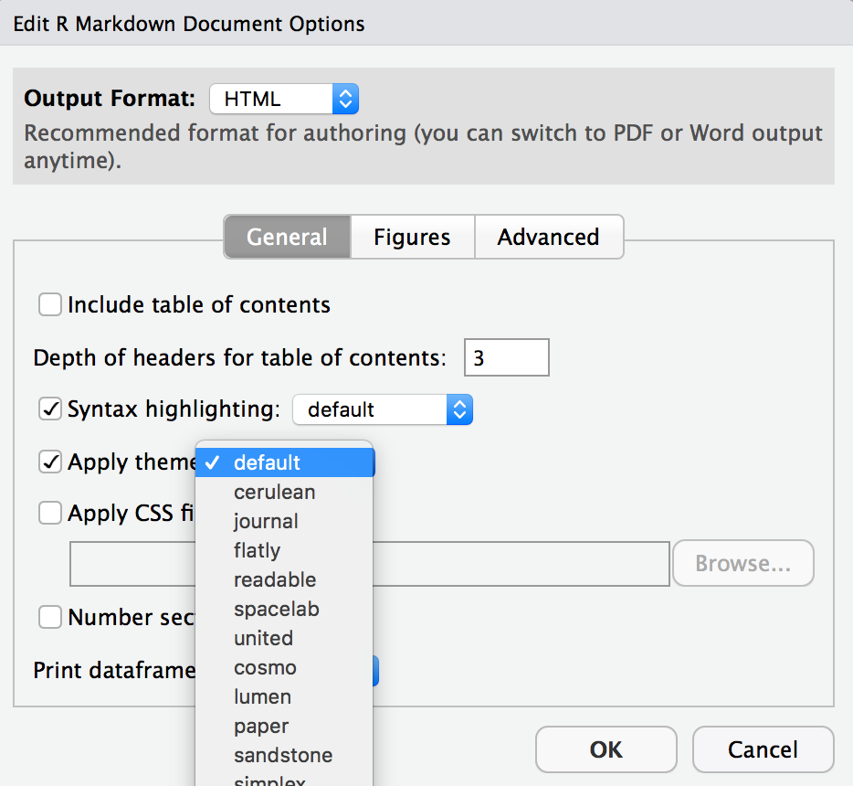
```

Open **Output Options...** again and experiment with available syntax-highlighting and theme options. Knit after making changes so you can see the effect.

# Submission checklist

Before you finish, confirm that:

- [ ] I signed the academic-integrity statement in both the instructions and starter files.
- [ ] My name and date are correct in the starter-file YAML.
- [ ] I answered every requested question in complete sentences.
- [ ] All required code is contained in the starter `.Rmd` file, not only in the Console.
- [ ] My plots and numerical outputs appear as expected.
- [ ] I ran the analysis from top to bottom.
- [ ] `lab-01-starter.Rmd` Knits without errors.
- [ ] I committed and pushed all final changes to GitHub.
- [ ] My Git pane is clear and the latest files are visible in my GitHub repository.

🧶 ✅ ⬆️ **Final step:** Knit, commit all remaining changes with a message such as `Complete Lab 1`, and push them to GitHub.
